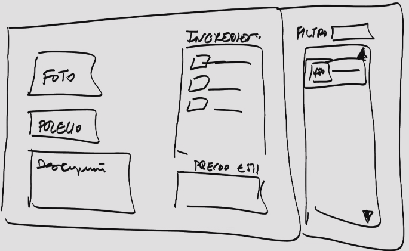

• La web debe tener un administrador que será la persona que inserte los ingredientes
que los usuarios podrán seleccionar a la hora de pedir un Kebab, incluyendo foto,
precio y descripción de cada ingrediente. (alérgenos) => CLIENTE Y API EN SERVIDOR

• Además, el administrador podrá crear Kebabs “de la casa” que ya vienen creados con
unos ingredientes determinados (esos ingredientes deben estar insertados
previamente) y con un precio determinado. => CLIENTE

• Por supuesto, el administrador podrá llevar un registro de todos los pedidos realizados
mensualmente, ordenados por fechas, calculando el importe total de ventas
mensuales (Gráficos de ventas mensuales, por tipos de kebab, ingredientes). Se
podrá ver también el desglose de cada pedido. => SERVIDOR Y GRÁFICOS EN EL CLIENTE

• Los usuarios podrán seleccionar el pedido de un “Kebab de la casa” o un “Kebab al
gusto”. (Para la selección de kebab se activará el arrastre de ingredientes y el click) => CLIENTE

• Si el Kebab seleccionado es de la casa, ya me pondrá los ingredientes que lleva por
defecto, permitiendo que el usuario pueda quitar algún ingrediente o añadirle nuevos
ingredientes (Convirtiéndolo en uno personalizado). El precio se ha de calcular sobre
el precio base que el administrador haya puesto para ese Kebab, más el precio que
haya establecido para cada ingrediente. (el precio no podrá ser inferior al base, si quito
un ingrediente base y lo vuelvo añadir no se cobra extra, si añado ingredientes extra
además de los base, sí se cobran extra) => CLIENTE

• Si el Kebab seleccionado es al gusto, me pondrá un precio base para los 3 ingredientes
de menor valor y si añado más, se cobran como extra en función del precio (cobrando
los más caros a partir del cuarto ingrediente). => CLIENTE Y API EN SERVIDOR

• El precio del Kebab debe reflejarse siempre bien visible, puesto que va a ser dinámico
en función de los ingredientes que se añadan o eliminen. => CLIENTE

• Una vez añadido a mi pedido, puedo seguir añadiendo más Kebabs a mi pedido o
Finalizar la compra. (Tengo que poder editar los kebab que ya he añadido y poder
modificarlos) => CLIENTE (????)

• Si finalizo la compra correctamente, el administrador podrá ver que le ha llegado un
nuevo pedido y cambiar su estado como: Recibido, En preparación, Enviado o
Completado. => CLIENTE (????)

• Los usuarios podrán ver el estado de su pedido, además de ver los ítems de su pedido
y el desglose de ingredientes de cada item. => CLIENTE

• Si el usuario quiere cancelar el pedido, podrá hacerlo siempre que no entre en estado
“En Preparación o posterior”, si entra en ese estado no se puede devolver y no podrá
recuperar su dinero. => CLIENTE

• Para la simulación del pago, el usuario tendrá un “monedero”, donde se irá insertando
dinero en su cuenta de nuestra web y será con el que deba de hacer el pago y al que le
será devuelto en caso de pedido cancelado. => SERVIDOR

• ¿Mantenimiento de cuenta de usuario. Nombre, direcciones de envio, productos
usuales, etc….? => CLIENTE

*etc (alérgenos)


**Mantenimiento Kebab**



Api Devuelve para lista ingregientes
- Ingredientes [Colección de objetos ingredientes]
- Kebab vacio
  
(Si se esta modifiando)
- Ingredientes 
- Kebab ya creado

>[!NOTE]
> Los ingregientes pasan del filtro de la derecha a la sección de ingredientes de la izquierda


**Api devuelta JSON**

```json
{
    success: true, 
    data: {
            id: 1, 
            nombre: "lechuga", 
            alergenos: 1, precio: 130
    }, 
    href : "/App/Api/IngredienteApi.php?id=1"
}

```