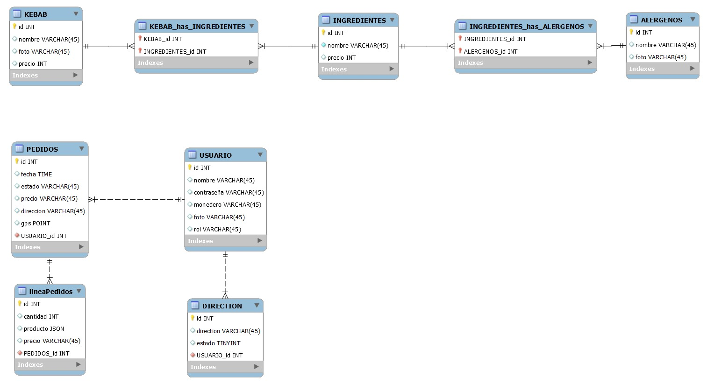

# KEBAB AMIGO

#### Entidades (BD)

- Kebab
  - id
  - nombre
  - foto
  - ingredientes

- Ingredientes
  - id
  - nombre
  - alergenos [VARCHAR]

- Alergenos
  - ID
  - Nombre
  - Foto

- Usuario
  - id
  - foto
  - nombre
  - contraseña
  - dirección
  - monedero

- Linea de pedido

- Pedidos
  - Usuario
  - Linea de pedido
  - fecha, hora
  - Estado
  - Precio
  - Dirección

## Relaciones

- Kebab e Ingredientes (muchos a muchos)
-  Linea de pedido Kebabs 
- Alergenos e Ingredientes
- Alergenos y usuarios

## Freatures

### Catalogo
- Creación de kebabs y muestra en el catalogo
- Copia y pega para la creación de kebab nuevo padre en el catalogo

### Base de datos

- Cambios en los kebabs se guarda como tupla nueva en la BD
- Guardar copia entera de los productos de la factura en la BD para evitar cambios de precios post compra
- Guarda nombre del kebab y concatena los ingredientes guardados o quitados 
- Array de productos de pedidos
  
```
{Orden de linea},cantidad, Nombre, Lista de ingredientes, precio total
```
```
{Orden de linea}, 4, kebab+queso+cebolla-lechuga, 2
```
```
[
	{
	"kebab": 3,
	"cantidad": 2,
	"ingredientes": "mixto+queso+cebolla",
	"precio": 2
	}
]
```

**DIAGRAMA**



### Factura
- La linea de pedido es cada producto vendido con la factura (se detalla cada producto con ingredientes, precio, etc)
  