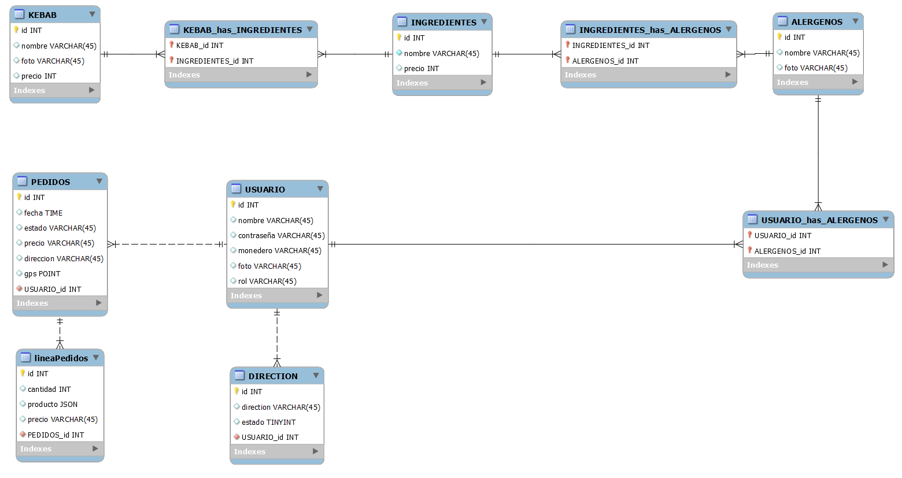
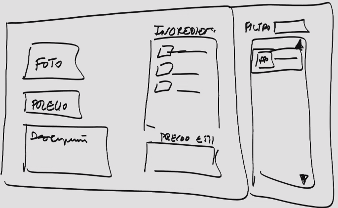

# KEBAB AMIGO

#### Entidades (BD)

- Kebab
  - id
  - nombre
  - foto
  - ingredientes

- Ingredientes
  - id
  - nombre
  - alergenos [VARCHAR]

- Alergenos
  - ID
  - Nombre
  - Foto

- Usuario
  - id
  - foto
  - nombre
  - contraseña
  - dirección
  - monedero

- Linea de pedido

- Pedidos
  - Usuario
  - Linea de pedido
  - fecha, hora
  - Estado
  - Precio
  - Dirección

## Relaciones

- Kebab e Ingredientes (muchos a muchos)
-  Linea de pedido Kebabs 
- Alergenos e Ingredientes
- Alergenos y usuarios

## Freatures

### Catalogo
- Creación de kebabs y muestra en el catalogo
- Copia y pega para la creación de kebab nuevo padre en el catalogo

### Base de datos

- Cambios en los kebabs se guarda como tupla nueva en la BD
- Guardar copia entera de los productos de la factura en la BD para evitar cambios de precios post compra
- Guarda nombre del kebab y concatena los ingredientes guardados o quitados 
- Array de productos de pedidos
  
```
{Orden de linea},cantidad, Nombre, Lista de ingredientes, precio total
```
```
{Orden de linea}, 4, kebab+queso+cebolla-lechuga, 2
```
```
[
	{
	"kebab": 3,
	"cantidad": 2,
	"ingredientes": "mixto+queso+cebolla",
	"precio": 2
	}
]
```

**DIAGRAMA**



### Factura
- La linea de pedido es cada producto vendido con la factura (se detalla cada producto con ingredientes, precio, etc)

**Mantenimiento Kebab**



Api Devuelve para lista ingregientes
- Ingredientes [Colección de objetos ingredientes]
- Kebab vacio
  
(Si se esta modifiando)
- Ingredientes 
- Kebab ya creado

>[!NOTE]
> Los ingregientes pasan del filtro de la derecha a la sección de ingredientes de la izquierda

**Formato de la conexión con la API**
```js
async function NombreFuntion(variales) {

    try {
        // Asegurarnos de que los parámetros no sean undefined o null
        if (!variable || !variable) {
            throw new Error('Los valores son requeridos');
        }

        // Hacemos la solicitud GET usando fetch
        const response = await fetch(baseUrlUser, {
            method: 'POST',
            headers: {
                'Content-Type': 'application/json'
            },
            body: JSON.stringify({ variable: variable })
        }); 
        // Verificamos si la respuesta fue exitosa
        if (!response.ok) {
            const errorMessage = await response.text(); // Obtener texto de la respuesta si hay error
            throw new Error(`Error ${response.status}: ${errorMessage}`);
        }

        const data = await response.json();
        console.log(data);
    } catch (error) {
        console.log('Error al crear el user ', error);
    }
}

```


**Api devuelta JSON**

```json
{
    "success": true, 
    "data": {
            "id": 1, 
            "nombre": "lechuga", 
            "alergenos": 1, 
            "precio": 130
    }, 
    "href" : "/App/Api/IngredienteApi.php?id=1"
}

```